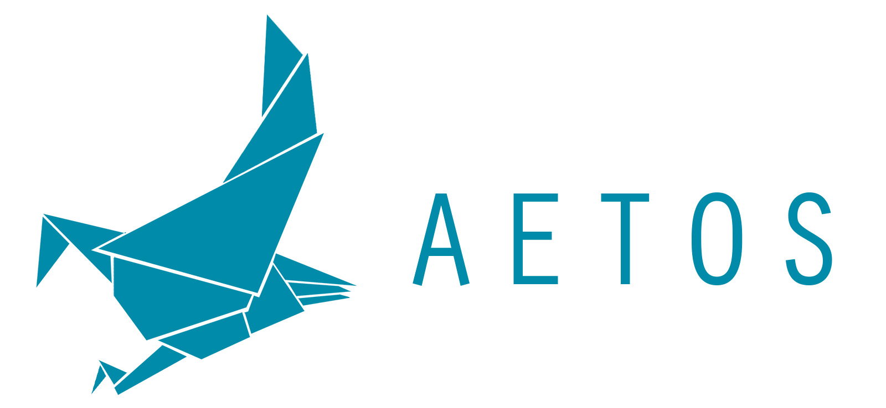
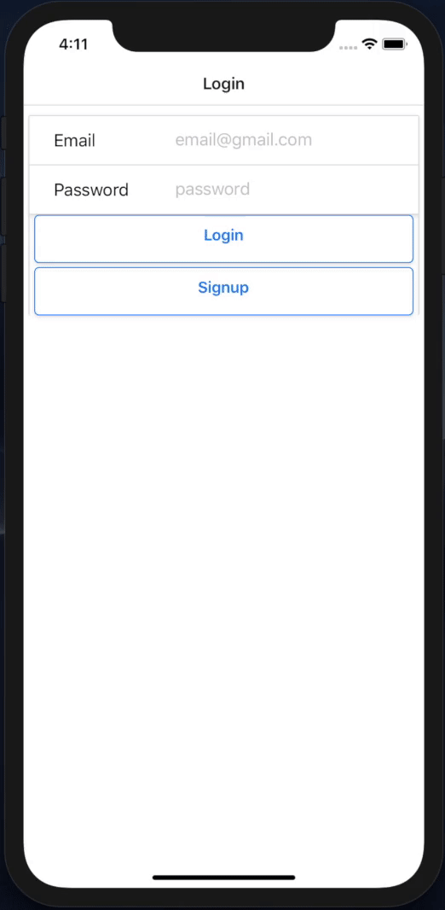
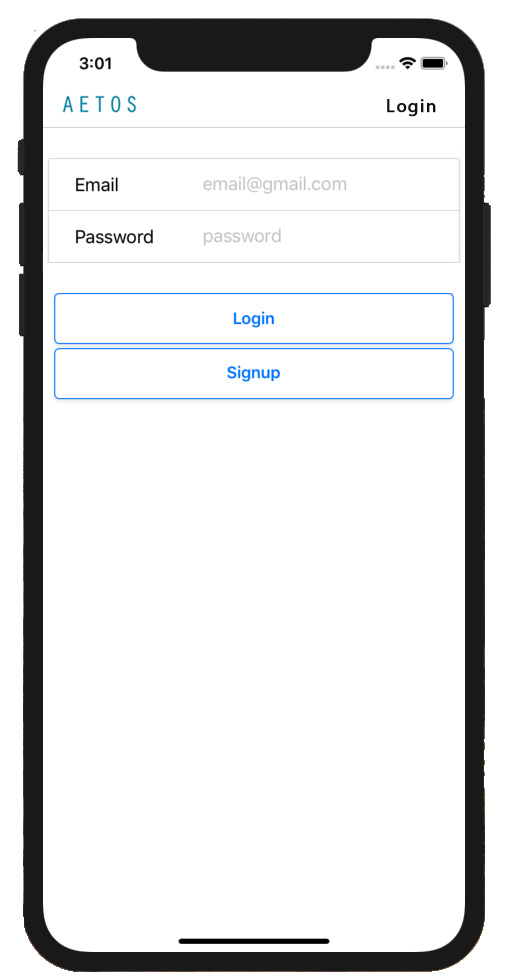
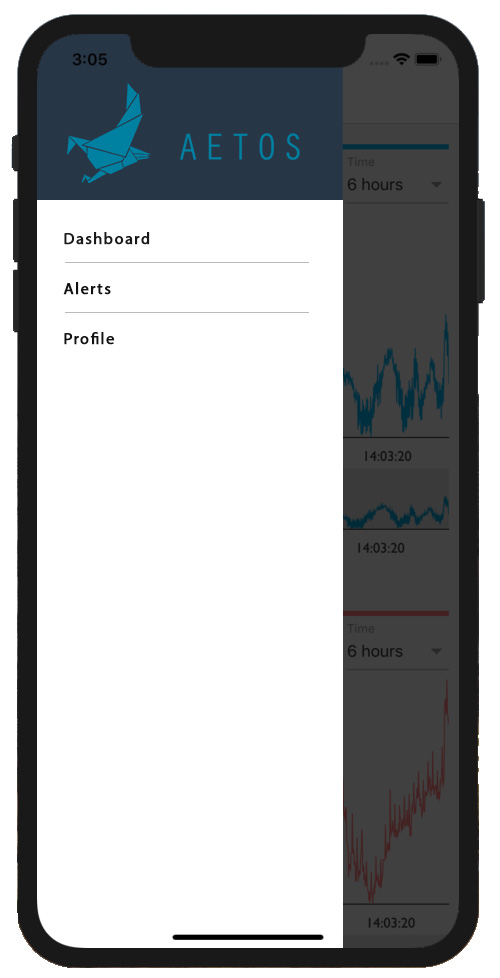
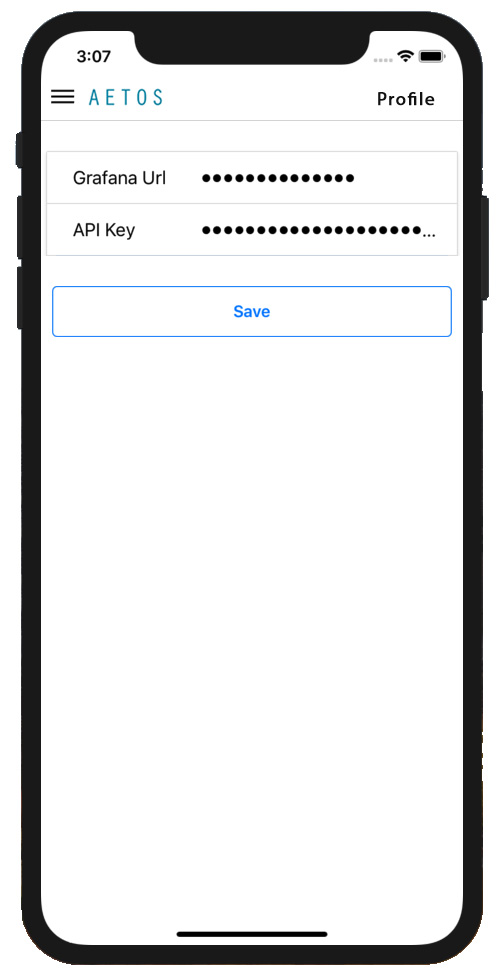
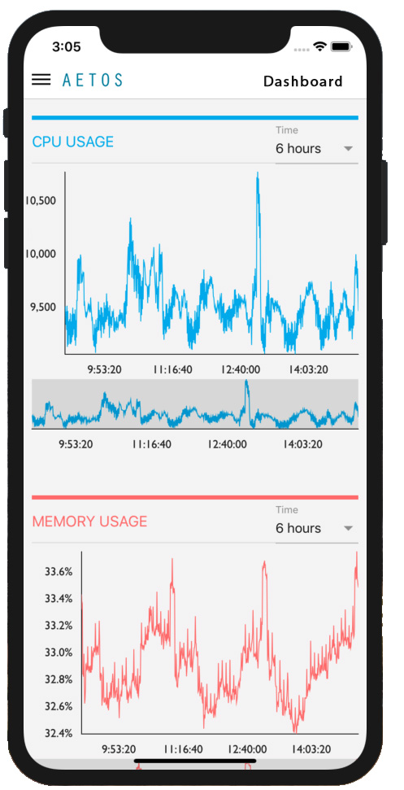
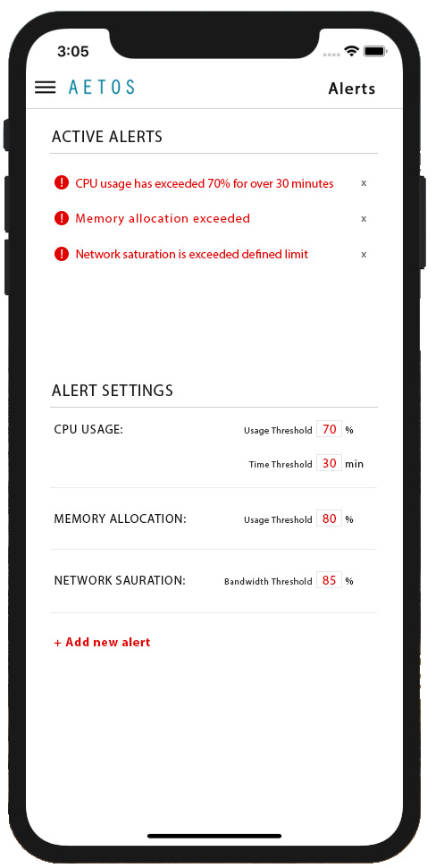

### Aetos is a mobile application for monitoring the health & performance of GCE Kubernetes clusters.

Accessing real-time metrics of Kubernetes data is imperative in order to ensure proper cluster health & performance. But keeping an eye on these metrics can get tricky.

Aetos is a new mobile visualization tool that allows you to view all of your Kubernetes cluster metrics in one place. It automatically scrapes your cluster and retrieves real-time data metrics in four key areas — CPU Usage, Network Saturation, System Saturation, and Memory Usage.

Simply log in to the Aetos application and enter the URL for where your Kubernetes Grafana interface is located, as well as the API key for authentication.

Upon authorization, you’ll be redirected to the metrics display where you can easily view and interact with real-time-data charts. You also have the option to set custom alerts on these metrics in order to be notified of any serious changes in your cluster’s performance.

## How it works:

Aetos uses PromQL, an industry-leading scraping language, in order to gather metrics in these key areas:
CPU Usage: allows you to reveal system consumption and prevent bottlenecks that will hinder performance
Memory Usage: systems that run up against memory limits will begin to swap in order to counterbalance the limits, and swapping will rapidly degrade performance
Network Saturation & System Saturation: making sure that saturation stays below your pre-determined acceptable levels, alerting you of possible DOS attacks and helping you preventing unnecessary collisions in the long run.

## Getting Started with Aetos
Aetos is extremely easy to get up and running. Once you've downloaded the application from the iOS app store (Android version launching soon), do the following:

1. Enter your login information on the login page.
2. Enter the Grafana URL where you cluster API is located.
3. Enter the Grafana API key specific to your cluster.
4. You will automatically be navigated to the display page.

Optional: Navigate to the alerts page in order to set custom alerts.

Click on each picture to enlarge.

<table style="width:100%">
<tr>

  <td>
    <a href="assets/login.jpg">
    
<b>Login</b>

    
    </a>
  </td>

  <td>
    <a href="assets/side-nav.jpg">
    
<b>Navigation</b>

    
    </a>
  </td>

  <td>
    <a href="assets/profile.jpg">
    
<b>Credentials</b>

    
    </a>
  </td>

  <td>
    <a href="assets/dashboard.jpg">
    
<b>Dashboard</b>

    
    </a>
  </td>
  

  <td>
    <a href="assets/alerts.jpg">
    
<b>Alerts</b>

    
    </a>
  </td>

</tr>
</table>

#### [Note: Aetos is in active development. An android version of this application will be available soon.]

## Contributors

[Robert McHalffey](https://github.com/calffey) | [Jay Cogen](https://github.com/JayCogen44) | [Tristan Schoenfeld](https://github.com/trischoe) | [Kenny Brisco](https://github.com/Kenneth-Brisco)